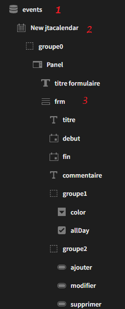
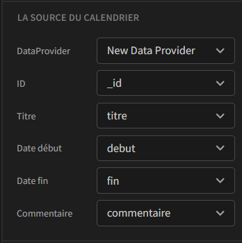
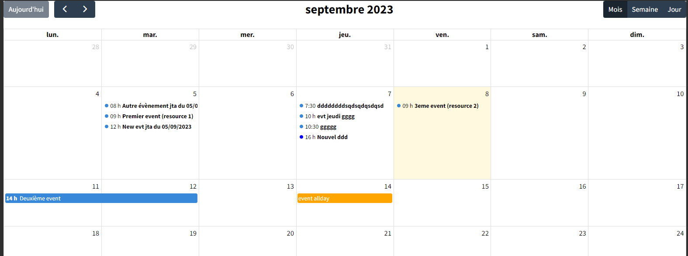
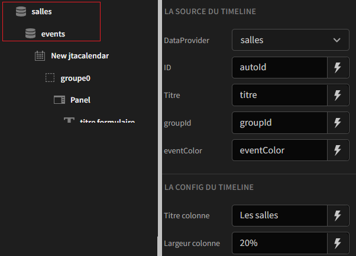
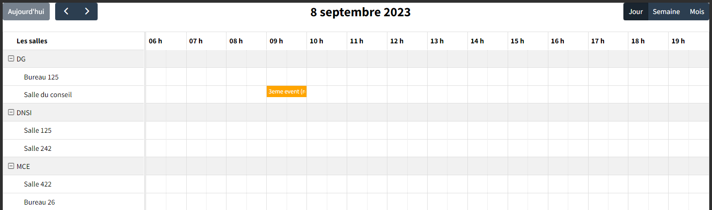
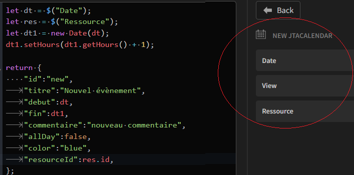
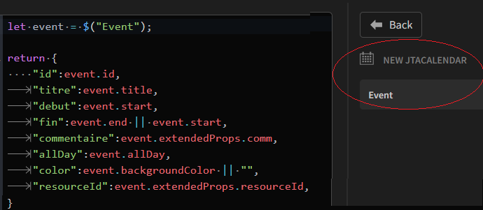
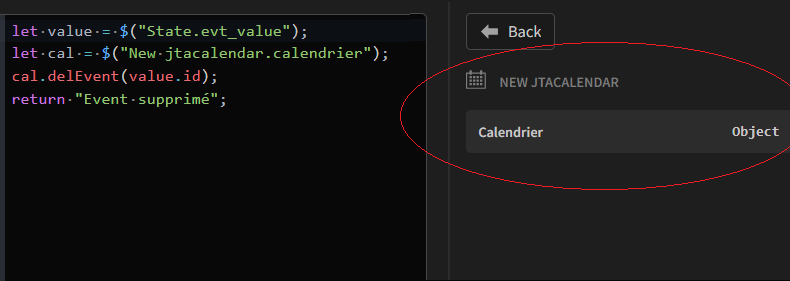

# Jtacalendar

# Description
Ce plugin budibase implémente le composant [FullCalendar](https://fullcalendar.io/). Il propose l'utilisation du plugin [timeLine](https://fullcalendar.io/docs/timeline-view) qui nécessite une [licence commerciale](https://fullcalendar.io/license). Si vous utilisez le composant en mode **timeLine** dans le cadre d'une utilisation commerciale, il faudra renseigner la licence dans la configuration du composant budibase. Par défaut, le plugin utilise une licence temporaire non commerciale.

## configuration
- **Licence** : La licence commerciale ou la licence temporaire non commerciale 
- **Style** calendrier : Style CSS qui sera appliqué sur le container principal du composant
- **Min time, Max time** : Les bornes horaires (format "heure:minutes:secondes")
- **Editable** : true pour pouvoir créer / modifier / supprimer des évènements. False pour un simple affichage
- **Timeline** : true pour basculer le composant en mode timeline. False pour basculer le composant en mode classique.

## Ajouter un calendrier dans une page
<table><tr><td>
<p></p>
</td><td valign="top">

1. Ajouter un dataProvider

2. Ajouter le composant jtaCalendar au dataprovider

3. Ajouter un formulaire au composant jtaCalendar. Cette forme portera les champs permettant de créer/modifier un évènement

</td></tr></table>

Il faut ensuite lier les données des évènements au dataprovider.  **Astuce** : utiliser l'ID interne (_id) de la table comme id des évènements.
<p></p>

Les champs suivants sont à ajouter à la table des évènements : 
- **resourceId** (string) : permet d'enregistrer l'id de la ressource associée à l'évènement (mode "timeLine")
- **allDay** (boolean) : true pour rendre l'évènement "allDay", false sinon (défaut)
- **color** (string) : permet d'enregistrer une couleur à associer à l'évènement. Si vide : l'évènement prendra la couleur par défaut (mode "classique") ou la couleur de la ressource associée (mode "timeLine")

### Mode "classique"
<p></p>

### Mode "timeLine"
Ajouter un dataprovider qui exposera les données des ressources timeline, puis positionner le dataprovider des évènements en tant que **fils** de ce dataprovider
<table><tr><td>
<p></p>
</td><td valign="top">
<br><br>
Lier les champs suivants au dataprovider "timeline"

- **id** l'identifiant de la ressource (doit être unique)
- **titre** le libellé de la ressource
- **groupID** : permet de regrouper les ressources
- **eventColor** associe une couleur à la ressource. Les évènements qu'on associera à cette ressource prendront la couleur de la ressource, sauf si une couleur a été attribué à l'évènement

</td></tr></table>

<p></p>

## Le contexte exposé par le plugin
Le composant jtacalendar **expose un contexte** sous la forme d'un objet "**calendrier**" proposant les méthodes:
- **getInstance()** : retourne une instance du calendrier
- **addEvent(event)** : ajoute l'évènement event dans le calendrier
- **delEvent(id)** : supprime l'évènement id dans le calendrier
- **updateEvent(event)** : modifie l'évènement event dans le calendrier
- **getResourceId(event)** : retourne l'id de la ressource associée à l'évènement event (mode timeline)

La structure d'un event : 
```
{
	id: l'id,
	start: date de début,
	end: date de fin,
	title: titre,
  	resourceId: l'id de la ressource associée (mode timeline),
	commmentaire: un commentaire associé (Facultatif),
	allDay: true si allDay, false sinon,
	color: couleur de l'évènement (green, red, ... Facultatif)
};
```

## Ajouter un évènement
Lorsqu'on clique sur une date, le composant jtacalendar joue l'action "**Click sur jour**", et expose 3 propriétés : 
- **la date** : la date sur laquelle on a cliqué
- **La view** : Le type de la view dans laquelle on se trouve
- **La ressource** : La ressource concernée (mode timeline) => Pour récupérer l'id à mettre dans l'event à créer

<p></p>
Puis : 

```
let cal = $("New jtacalendar.calendrier");
cal.addEvent(evt);
```

N'oubliez pas ensuite de sauvegarder l'évènement créé dans la table...

## Modifier un évènement
Lorsqu'on clique sur un évènement, le composant calendar joue l'action "**Click sur event**", et expose [l'event](https://fullcalendar.io/docs/event-object) sur lequel on a cliqué.

<p></p>
Puis : 

```
let cal = $("New jtacalendar.calendrier");
cal.updateEvent(evt);
```

N'oubliez pas ensuite de sauvegarder l'évènement modifié dans la table...

## Déplacer / redimentionner un évènement
Lorsqu'on déplace / redimentionne un évènement, le composant calendar joue l'action "**Event change**", et expose 3 propriétés : 
- **event** : [L'event modifié](https://fullcalendar.io/docs/event-object)
- **old event** : [L'ancien event](https://fullcalendar.io/docs/event-object)
- **resource id** : L'id de la ressource associée à l'évent modifié (mode timeline) 

Il s'agit simplement de sauvegarder l'évènement modifié (event) dans la table...

## Supprimer un évènement

<p></p>

N'oubliez pas ensuite de supprimer l'évènement dans la table...

<hr>

# Plugins budibase

## Installer (docker) budibase 

(cf Guillaume)

Dans le répertoire **C:\produits\budibase**, on place les fichiers **.env** et **docker-compose.yaml** récupérés dans l'install docker

## Installer (si besoin) la dernière version de Budibase CLI 

```
npm install -g @budibase/cli
```

## Installer (si besoin) yarn 

```
npm install -g yarn
```

## On crée un répertoire pour les plugins 

C:\produits\budibase\plugins

## On modifie les fichiers de configuration docker

### Fichier <u>docker-compose.yaml</u>

On ajoute le répertoire des plugins (et son point de montage) au app-service volumes
```
app-service:	
    volumes:
      - ./plugins:/plugins
```	  

### Fichier <u>.env</u>

On renseigne la variable **PLUGINS_DIR** avec le point de montage spécifié dans **docker-compose.yaml**
```
PLUGINS_DIR=/plugins
```

## Initialisation du plugin

On initialise le plugin dans le répertoire des plugins
```
cd C:\produits\budibase\plugins
budi plugins --init component
```
et on renseigne les infos demandées (name, description, version, ...). Un répertoire est créé avec le nom du plugin

After you have created your new plugin directory, execute the following:
```
cd <le_répertoire_du_composant>
yarn build
```
ou 
```
cd <le_répertoire_du_composant>
budi plugins --build
```
You can also re-build everytime you make a change to your plugin with the command:
```
budi plugins --watch
```

## démarrer budibase

```
cd C:\produits\budibase
docker-compose up 
// ou docker-compose up -d    (-d pour "mode demon", sinon y rend pas la main, et il faudra faire CTRL C pour stopper budibase)
```
Le nouveau plugin doit maintenant apparaitre dans la liste des plugins installés dans budibase

## Arréter budibase 

```
cd C:\produits\budibase
docker-compose stop
```

<br>
Find out more about [Budibase](https://github.com/Budibase/budibase)